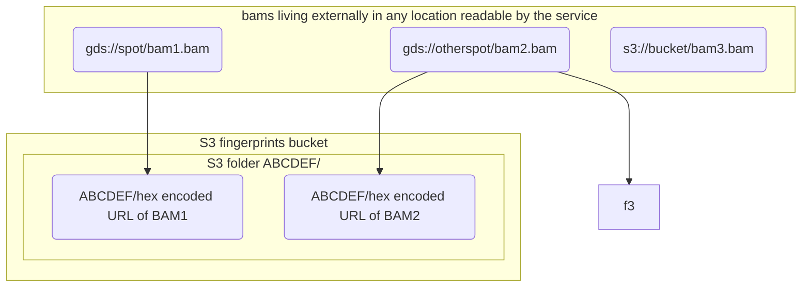

# holmes

An AWS Steps based service that does bioinformatics fingerprint checks,
deployed as a CDK pipeline project.

## Overview

The `somalier` tool is a useful tool for generating genomics fingerprint files -
taking a BAM file and producing a much smaller representation
of variance at set locations throughout.

These files can then be compared to each other and rated with a 'relatedness' score. Where
genomics files are samples from the sample human, or close relatives - this score
is high, and therefore the `relatedness` score can help guard against
sample mix-ups - by uncovering where unexpected relationships exist between
samples.

## Developers

Before doing any development work - please see [here](docs/DEV.md) for dev setup instructions.

## Service

### Invoke

The service provides all entry points as AWS Steps functions.

These functions are registered into the `umccr` namespace.

Only one service instance will ever be registered in the namespace, so
the technique for service discovery is to locate the `fingerprint`
service - and then select the one and only service instance present.
Then choose the custom attribute that matches the Steps function Arn
to invoke.

---

#### Extract

`umccr -> fingerprint -> (single service) -> extractStepsArn`

with an input of

```json
{
  "needsFingerprinting": [
    [
      "gds://development/sample1.bam",
      "gds://development/sample2.bam"
    ],
    [
      "gds://development/sample3.bam"
    ]
  ],
  "...": ...
}
```

and produces output of the form

```json
{}
```

Each entry in the `needsFingerprinting` array will cause a new ECS Task
to be invoked for performing the fingerprinting. There are some advantages to
doing multiple fingerprints sequentially in the task, so it is up to the
invoker to chose how many BAMs to process on each Task.

Fingerprinting each BAM takes approximately 15 minutes.

---

#### Check

`umccr -> fingerprint -> (single service) -> checkStepsArn`

with an input of

```json
{
  "indexes": ["gds://development/sample1.bam", "gds://development/sample2.bam"],
  "fingerprintFolder": "fingerprints/",
  "relatednessThreshold": 0.4
}
```

`fingerprintFolder` and `relatednessThreshold` are optional.

produces output of the form

```json
[
  {
    "file": "gds://development/sample1.bam",
    "relatedness": 1,
    "ibs0": 0,
    "ibs2": 16146,
    "hom_concordance": 1,
    "hets_a": 6163,
    "hets_b": 6163,
    "hets_ab": 12326,
    "shared_hets": 6163,
    "hom_alts_a": 5389,
    "hom_alts_b": 5389,
    "shared_hom_alts": 5389,
    "n": 16146,
    "x_ibs0": 0,
    "x_ibs2": 769
  }
]
```

The index BAM should _always_ be returned with a relatedness of 1 - confirming that
the service is working. Any other BAMs that have a relatedness above the threshold
will also be returned.

This service takes approximately 15 seconds to run.

---

## Costing

Estimates are available [here](docs/COSTS.md). They have been shown in
practice to be roughly correct.

## Design

The service maintains an S3 bucket that stores fingerprint files (~200k per BAM) and then
provides AWS Steps functions that operate to run `somalier` over these files.



The operations provided by the service are focussed around
a) producing new fingerprints
b) checking fingerprints against others

There is no other data store for the service - the existence of a fingerprint
in S3 with a path matching the sites checksum and BAM URL (hex encoded) is
the canonical definition that a BAM has been fingerprinted.

The check operation will always operate against all fingerprints that
exist in the designated fingerprint folder.

### Lambdas

A single Docker lambda image is created that contains all code executed via Steps.

This lambda image has the `somalier` tool compiled directly into the Docker image.

`somalier` cannot source fingerprints via network - so each lambda must download
the subset of fingerprints it is working on to the lambda /tmp directory - call
`somalier` and then return the results.

The lambdas are distributed concurrently using Steps Map - which means that no
one lambda is required to spend too much time downloading files, nor can the files
overflow its /tmp directory.

THe lambda _could_ be taught to source somalier files from any
source - currently supported are S3 and GDS.

## Step

The step function can be executed with the equivalent of

```
aws stepfunctions start-execution \
 --state-machine-arn arn:aws:states:ap-southeast-2:843407916570:stateMachine:StateMachine2E01A3A5-mOp8QLUdyXFQ \
 --cli-input-yaml file://adhoc-test-invoke-input.yaml
```

where the test input is

```yaml
input: >
  {
    "index": "gds://development/analysis_data/SBJ00480/wgs_alignment_qc/20211128e4a69bdb/L2000966__1_dragen_somalier/PTC_Tsqn201109MB.somalier",
  }
```
