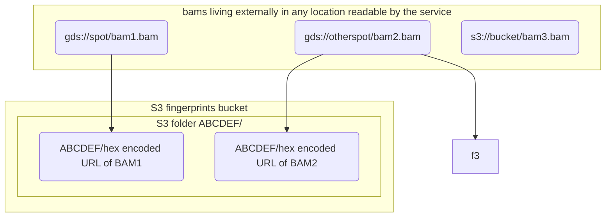

# holmes

An AWS Steps based service that does bioinformatics fingerprint checks,
deployed as a CDK pipeline project.

## Overview

The `somalier` tool is a useful tool for generating genomics fingerprint files -
taking a BAM file and producing a much smaller representation
of variance at set locations throughout.

These files can then be compared to each other and rated with a 'relatedness' score. Where
genomics files are samples from the sample human, or close relatives - this score
is high, and therefore the `relatedness` score can help guard against
sample mix-ups - by uncovering where unexpected relationships exist between
samples.

Holmes is a low-cost (activity only costing - almost no cost as rest) tool that can be interacted
with via AWS API (Lambda and Steps) OR via Slack commands. It will perform a variety
of `somalier` calls over a large database of fingerprints.

## Developers

Before doing any development work - please see [here](docs/DEV.md) for dev setup instructions.

## Service (as API)

See [here](docs/API.md)

## Service (as Slack command)

See [here](docs/SLACK.md)

## Configuration

It is possible to change some of the base settings of Holmes - details are [here](docs/CONFIG.md).

## Costing

Estimates are available [here](docs/COSTS.md). They have been shown in
practice to be roughly correct.

## Design

The service maintains an S3 bucket that stores fingerprint files (~200k per BAM) and then
provides AWS Steps/Lambda functions that operate to run `somalier` over these files.

The operations provided by the service are focussed around
a) producing new fingerprints
b) checking fingerprints against others

There is no other data store for the service - the existence of a fingerprint
in S3 with a path matching the sites checksum and BAM URL (hex encoded) is
the canonical definition that a BAM has been fingerprinted.

The check operation will always operate against all fingerprints that
exist in the designated fingerprint folder.

## Algorithm

The details of how `somalier` scores are used is documented [here](docs/ALGORITHM.md).
