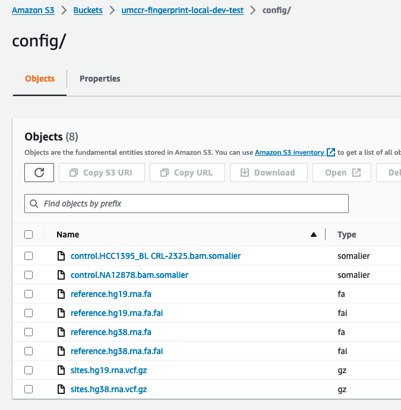

# Config

Holmes is driven from two configuration sources

- the CDK settings used to deploy it (environment variables)
- the objects/structure of the fingerprints bucket

So the primary settings that are set by CDK are

- the fingerprint bucket name = the S3 bucket name where _all_ fingerprint activity takes place
- the fingerprint config folder = the trailing slash terminated S3 key that houses config objects (generally by naming convention of the objects)

Using the above settings - we can locate the configuration objects.

We can see the two naming conventions of objects:

- the allowed `reference` values. In this case - there are two references `["hg19.rna", "hg38.rna"]`.
  each reference MUST have an accompanying `sites.????.vcf.gz` files and accompanying
  `reference.????.fa` and `reference.????.fa.fai`.

- the `control` fingerprints. In this case - there are two controls `["NA12878","HCC1395_BL CRL-2325"]`.
  each control is just a fingerprint - but must have the corresponding name convention of `control.????.bam.somalier`
  in order to be detected

The fingerprint folder is also another configuration settings - a trailing slash terminated
S3 key that houses the actual fingerprints - though this configuration settings can be
altered on most invocations. By default it is set to `fingerprints/`. You can see inside
the fingerprints folder of the bucket to see which fingerprints currently exist.
